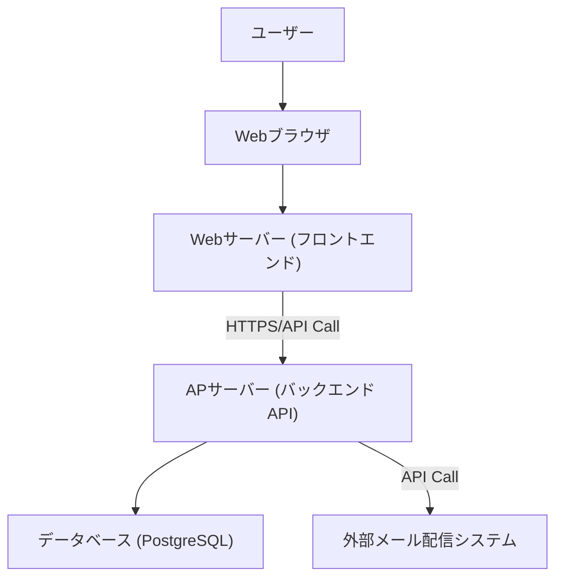
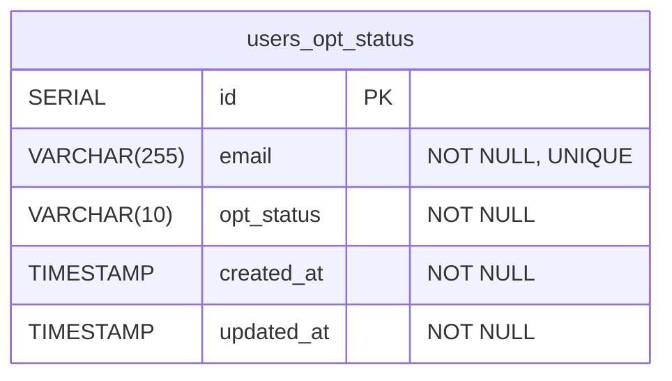
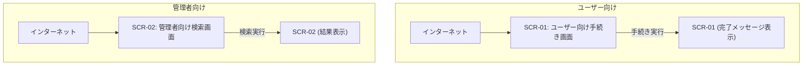

# 広告メール許諾管理システム 基本設計書

| 項目 | 内容 |
| :---|:---|
| ドキュメントバージョン | 1.0 |
| 作成日 | 2025/07/14 |
| 作成者 | Gemini |
| 関連ドキュメント | 広告メール許諾管理システム 要件定義書 Ver.1.0 |

-----

## 1. はじめに

本ドキュメントは、「広告メール許諾管理システム 要件定義書」に基づき、システムの実現に必要な基本設計を定義するものです。

-----

## 2. システム構成図

本システムは、ユーザー向けWebフロントエンド、バックエンドAPI、データベースで構成されます。外部のメール配信システムとはAPI経由で連携します。



-----

## 3. データベース設計 (Database Design)

### 3.1. ER図 (Entity-Relationship Diagram)

本システムで利用するテーブルは以下の通りです。



### 3.2. テーブル定義

**テーブル名: users_opt_status**

ユーザーのメールアドレスと広告メールの許諾ステータスを管理します。

| カラム名 | データ型 | 制約 | 説明 |
|---|---|---|---|
| id | SERIAL | PRIMARY KEY | 一意なサロゲートキー |
| email | VARCHAR(255) | NOT NULL, UNIQUE | ユーザーのメールアドレス |
| opt_status | VARCHAR(10) | NOT NULL | 許諾ステータス。'Opted-in' または 'Opted-out' のいずれかの文字列を格納。 |
| created_at | TIMESTAMP | NOT NULL | レコード作成日時 |
| updated_at | TIMESTAMP | NOT NULL | レコード最終更新日時 |

-----

## 4. API設計 (API Design)

フロントエンドとバックエンド、および外部システムとの連携は以下のAPI仕様に準拠します。

### API-01: 許諾ステータス更新API

| 項目 | 内容 |
|---|---|
| API名 | 許諾ステータス更新API |
| 機能概要 | ユーザーのオプトイン・オプトアウトを受け付け、ステータスを更新する。 |
| エンドポイント | `/api/v1/opt-status` |
| HTTPメソッド | POST |

**リクエストボディ (Request Body)**

```json
{
  "email": "user@example.com",
  "action": "opt_in"
}
```

`action` は `"opt_in"` または `"opt_out"` のいずれかです。

**処理フローの概要**
1. リクエストボディのバリデーションを行う。
2. `action`の値に応じて、DBの`users_opt_status`テーブルを更新する。
3. **処理完了後、ユーザーに完了通知メールを送信する。（詳細は6. ビジネスロジックを参照）**
4. フロントエンドに処理結果を返す。

**レスポンス (Response)**

**成功時 (200 OK)**

```json
{
  "status": "success",
  "message": "Opt-in successful."
}
```

**バリデーションエラー時 (400 Bad Request)**

```json
{
  "status": "error",
  "message": "Invalid email format."
}
```

**対象データなし (404 Not Found) ※オプトアウト時のみ**

```json
{
  "status": "error",
  "message": "Email not found."
}
```

### API-02: 許諾ステータス取得API (外部連携用)

| 項目 | 内容 |
|---|---|
| API名 | 許諾ステータス取得API |
| 機能概要 | 【外部連携用】指定されたメールアドレスの許諾ステータスを取得する。 |
| エンドポイント | `/api/v1/status` |
| HTTPメソッド | GET |

**リクエストクエリパラメータ (Request Query Parameter)**

`email`: `user@example.com` (必須)

**レスポンス (Response)**

**成功時 (200 OK)**

```json
{
  "email": "user@example.com",
  "opt_status": "'Opted-in'",
  "updated_at": "2025-07-14T10:00:00Z"
}
```

**対象データなし (404 Not Found)**

```json
{
  "status": "error",
  "message": "Email not found."
}
```

### API-03: ユーザー検索API (管理者用)

| 項目 | 内容 |
|---|---|
| API名 | ユーザー検索API |
| 機能概要 | 【管理者用】メールアドレスでユーザーを検索し、許諾ステータス一覧を返す。 |
| エンドポイント | `/api/v1/admin/users` |
| HTTPメソッド | GET |

**リクエストクエリパラメータ (Request Query Parameter)**

`q`: `user@` (検索キーワード、任意)

**レスポンス (Response)**

**成功時 (200 OK)**

```json
{
  "results": [
    {
      "email": "user@example.com",
      "opt_status": "'Opted-in'",
      "updated_at": "2025-07-14T10:00:00Z"
    },
    {
      "email": "user2@example.com",
      "opt_status": "'Opted-out'",
      "updated_at": "2025-07-12T15:30:00Z"
    }
  ]
}
```

-----

## 5. 画面設計 (Screen Design)

### 5.1. 画面一覧

| 画面ID | 画面名 | URLパス |
|---|---|---|
| SCR-01 | ユーザー向け手続き画面 | `/` |
| SCR-02 | 管理者向け検索画面 | `/admin` |

### 5.2. 画面遷移図



### 5.3. 各画面の詳細設計

#### **画面ID: SCR-01 ユーザー向け手続き画面**

**概要**: ユーザーがオプトイン・オプトアウトを行うための単一ページです。

**レイアウト**:

| 要素名 | 種別 | 説明 |
| :--- | :--- | :--- |
| メールアドレス入力欄 | テキスト入力 | ユーザーのメールアドレスを入力する。 |
| プライバシーポリシー同意 | チェックボックス | オプトイン時に表示。同意が必須。 |
| 配信を希望するボタン | ボタン | API-01 (`action`: `"opt_in"`) を呼び出す。 |
| 配信を停止するボタン | ボタン | API-01 (`action`: `"opt_out"`) を呼び出す。 |
| メッセージ表示エリア | テキスト表示 | 処理結果（完了、エラー）を表示する。 |

**処理フロー**:

1.  ユーザーがメールアドレスを入力します。
2.  **配信を希望するボタン**をクリックした場合:
    a.  プライバシーポリシー同意チェックボックスがONになっているか検証します。
    b.  API-01を`action`: `"opt_in"`で呼び出します。
3.  **配信を停止するボタン**をクリックした場合:
    a.  API-01を`action`: `"opt_out"`で呼び出します。
4.  APIからのレスポンスに応じて、メッセージ表示エリアに結果を表示します。

#### **画面ID: SCR-02 管理者向け検索画面**

**概要**: 管理者がユーザーの許諾ステータスを検索・確認するための画面です。

**レイアウト**:

| 要素名 | 種別 | 説明 |
| :--- | :--- | :--- |
| メールアドレス検索窓 | テキスト入力 | 検索キーワード（メールアドレスの一部または全部）を入力する。 |
| 検索ボタン | ボタン | API-03を呼び出す。 |
| 検索結果一覧 | テーブル | 検索結果を表示する。 |

**検索結果一覧の表示項目**:
* メールアドレス
* 許諾ステータス
* 最終更新日時

**処理フロー**:
1. 管理者が検索窓にキーワードを入力し、検索ボタンをクリックします。
2. フロントエンドはAPI-03を呼び出し、検索結果を取得します。
3. 取得したJSONデータをテーブル形式で画面に表示します。

-----

## 6. ビジネスロジック (Business Logic)

### 6.1. 通知メール送信処理

**トリガー**: API-01の処理が正常に完了した時点。

**処理詳細**:
1.  API-01で受け取った`email`と`action`（`opt_in` or `opt_out`）を元に、送信するメールの内容を決定する。
2.  **オプトイン完了通知**:
    *   件名: 「【（サービス名）】メールマガジン登録完了のお知らせ」
    *   本文: 登録が完了した旨と、配信停止手続きの案内を記載する。
3.  **オプトアウト完了通知**:
    *   件名: 「【（サービス名）】メールマガジン配信停止完了のお知らせ」
    *   本文: 配信停止が完了した旨を記載する。
4.  設定されたSMTPサーバー経由で、対象のメールアドレスに通知メールを送信する。