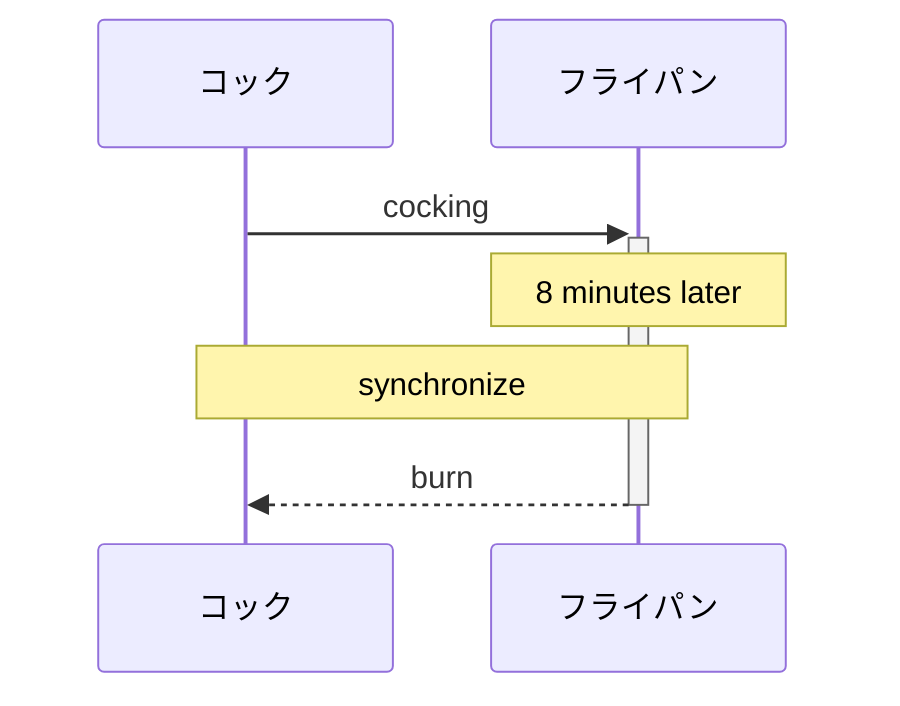
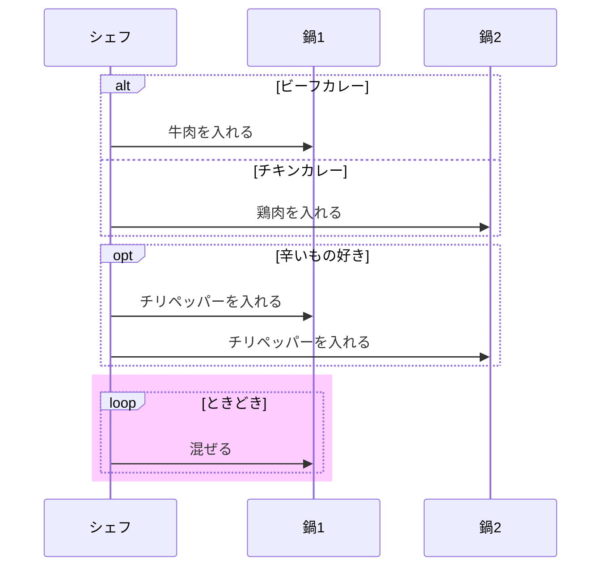
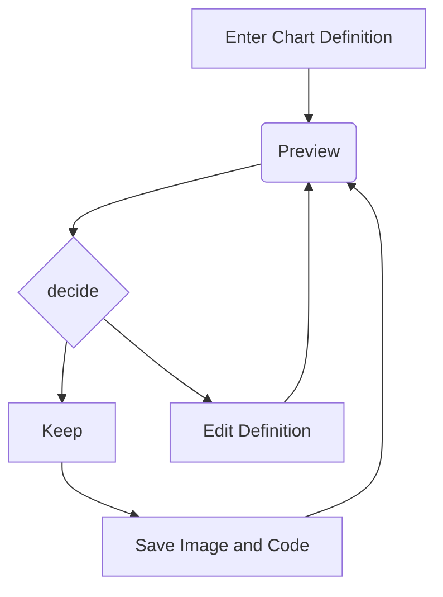

# mermaid

とりあえずシーケンス図。

## 記載方法

- `sequenceDiagram` から始める
- `participant cock as コック` でライフラインに命名できる
- `Note over lifeline1, lifeline2: text` でコメントを入れる
- `alt else end`で条件分岐
- `opt end`で条件指定
- `loop end`でループ
- `rect rgba(255, 0, 255, 0.2) end` で背景色指定
- `%% コメントコメント` で背景色指定

### 矢印

- `->>` 矢印
- `-->>` 点線矢印

### 実行仕様

- `->>+` 開始
- `->>-` 終了

## 例

### no.1

### no.2

### no.3

## link

- [qiita 記事](https://qiita.com/konitech913/items/90f91687cfe7ece50020)
- [公式](https://mermaid.js.org/intro/getting-started.html)